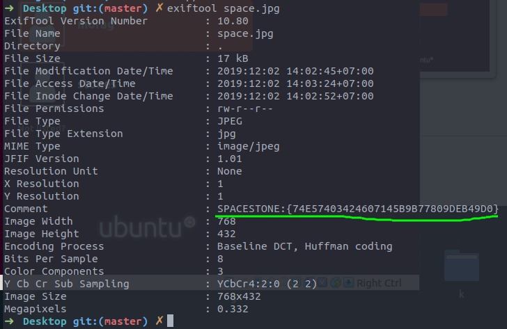
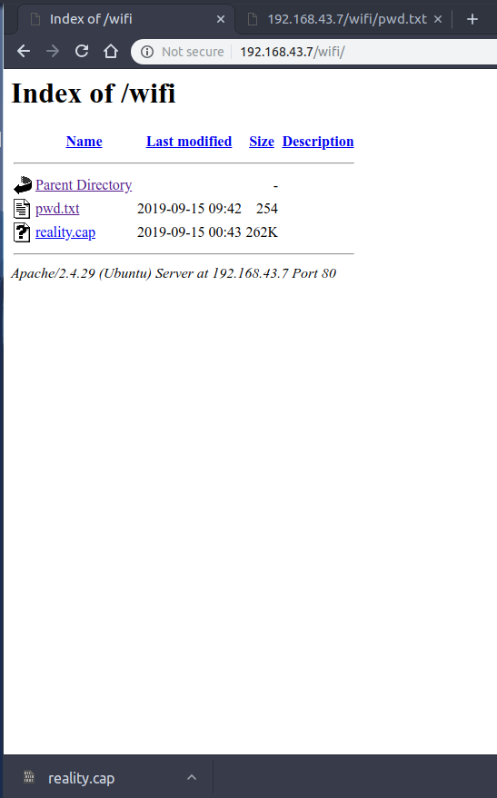

# HA: Infinity Stones Vulnhub Walkthrough

### Anggota Kelompok
1. M Imam Pratama (09021281722063) - Ketua
2. Farhan Furqan (09021281722045) - Anggota
3. Defrian Afandi (09021281722075) - Anggota
4. Hafiz Mursid (09021281722066) - Anggota
5. Adinda Aisyah Rismayani (09021181722074) - Anggota
6. Tita Dwi Yulian (09021181722079) - Anggota

Kelompok kami akan menyelesaikan tantangan **HA: Infinity Stones. Tantangan ini menggambarkan Thanos yang 
berusaha mengumpulkan 6 Batu Infinity yang telah disembunyikan para Avanger di seluruh CTF. Thanos berpikir 
jika dia membunuh setengah dari seluruh kehidupan di alam semesta, dia akan mengembalikan keseimbangan (bisa  
lihat di film "Avangers : Infinity War"). Untuk melakukannya ia membutuhkan keenam Batu Infinity untuk menguatkan 
Infinity Gauntlet-nya (sarung tangan untuk menyatukan kekuatan 6 batu infinity), yang akan memberinya kemampuan 
untuk mengubah waktu, ruang, energi dan hukum fisika serta kenyataan. Beberapa informasi di film "Avangers: Infinity 
War" dapat membantu kita menyelesaikan CTF ini. Flag yang akan kita cari dalam tantangan ini antara lain:

- Mind Stone
- Reality Stone
- Time Stone
- Power Stone
- Soul Stone
- Space Stone

**Download HA: Infinity Stones** [di sini](https://www.vulnhub.com/entry/ha-infinity-stones,366/) 
**Level : Intermediate** 
**Tugas : Mencari 6 Flag (Stone)**

* ## Network Scanning
    - Netdiscover
    - Nmap Scan

* ## Enumaration
    - Browsing HTTP Service
    - Dirb-Brute forcing web directory
    - Exiftool-Metadata extracting for 1st stone
    - 2nd stone from ssl certificate
    - Brainfuck Language - Decoder
    - Crunch-generate dictionary
    - Aircrack-ng-cracking password of pcap
    
* ## Exploiting
    - Metasploit - Jenkins

* ## Post Enumaration
    - Obtain 4th stone
    - John the ripper-crack Keepaas hashes
    - Obtain 5th stone

* ## Privilege Escalation
    - Abusing sudo rights
    - Get the Final stone

# Walkthrough

## Network Scanning

## Enumaration

## Exploiting

## Post Enumaration

## Privilage Escalation

### Batu 1

### Batu 2

<!--
### Batu 3

-->

### Batu 3

### Batu 4

### Batu 5

### Batu 6

