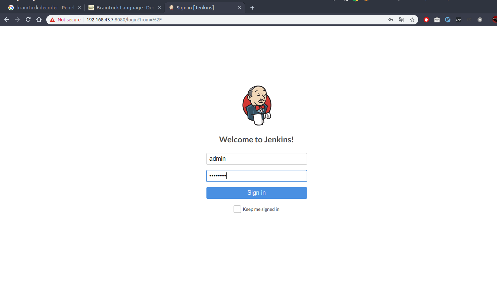
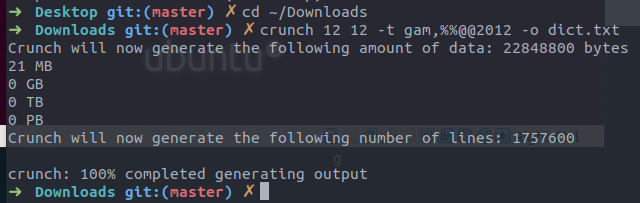

# HA: Infinity Stones Vulnhub Walkthrough

### Anggota Kelompok
1. M Imam Pratama (09021281722063) - Ketua
2. Farhan Furqan (09021281722045) - Anggota
3. Defrian Afandi (09021281722075) - Anggota
4. Hafiz Mursid (09021281722066) - Anggota
5. Adinda Aisyah Rismayani (09021181722074) - Anggota
6. Tita Dwi Yulian (09021181722079) - Anggota

Kelompok kami akan menyelesaikan tantangan **HA: Infinity Stones. Tantangan ini menggambarkan Thanos yang<br>
berusaha mengumpulkan 6 Batu Infinity yang telah disembunyikan para Avanger di seluruh CTF. Thanos berpikir<br>
jika dia membunuh setengah dari seluruh kehidupan di alam semesta, dia akan mengembalikan keseimbangan (bisa <br>
lihat di film "Avangers : Infinity War"). Untuk melakukannya ia membutuhkan keenam Batu Infinity untuk menguatkan<br>
Infinity Gauntlet-nya (sarung tangan untuk menyatukan kekuatan 6 batu infinity), yang akan memberinya kemampuan<br>
untuk mengubah waktu, ruang, energi dan hukum fisika serta kenyataan. Beberapa informasi di film "Avangers: Infinity<br>
War" dapat membantu kita menyelesaikan CTF ini. Flag yang akan kita cari dalam tantangan ini antara lain:

- Mind Stone
- Reality Stone
- Time Stone
- Power Stone
- Soul Stone
- Space Stone

**Download HA: Infinity Stones** [di sini](https://www.vulnhub.com/entry/ha-infinity-stones,366/)<br>
**Level : Intermediate**<br>
**Tugas : Mencari 6 Flag (Stone)**

* ## Network Scanning
    - Netdiscover
    - Nmap Scan

* ## Enumaration
    - Browsing HTTP Service
    - Dirb-Brute forcing web directory
    - Exiftool-Metadata extracting for 1st stone
    - 2nd stone from ssl certificate
    - Brainfuck Language - Decoder
    - Crunch-generate dictionary
    - Aircrack-ng-cracking password of pcap
    
* ## Exploiting
    - Metasploit - Jenkins

* ## Post Enumaration
    - Obtain 4th stone
    - John the ripper-crack Keepaas hashes
    - Obtain 5th stone

* ## Privilege Escalation
    - Abusing sudo rights
    - Get the Final stone

# Walkthrough

### Batu 1
Buka virtual box emulator HA: Infinity Stones, maka tampilannya seperti dibawah ini:<br>
<br>
Lakukan scanning network dengan netdiscover untuk mendapat IP dari virtual box HA: Infinity Stones, letak<br>
IP nya terdapat pada IP dengan MAC Vendor/ Hostname: _PCS Systemtechnik GmbH_.  
<br>
Scanning IP yang didapat dengan NMap, hasil dari scanning tersebut terdapat flag (stone) yaitu **MINDSTONE**.


### Batu 2
Buka IP di browser, dan hasilnya:
<br>
Pilih tab either pada laman browser yang dibuka. Terdapat beberapa pertanyaan, tetapi ada kata kunci yang<br>
menerangkan _Computers tell us Binary is the path to Reality_ yang artinya nilai binary ini menunjukkan pada<br>
Reality (Reality Stones). Untuk jawaban false = 0 dan true = 1. Didapat jawaban yang benar dengan dari<br>
8 pertanyaan yaitu **01101001**.
<br>
Lalu buka IP/Hasil jawaban yang berupa binary di laman browser. Terdapat hints.txt yang isinya berupa code.
<br>
Code yang didapat di decode dengan Brainfuck Language - Decoder. Didapat hasil **admin: avangers**.
<br>
Lalu menuju Jenkins dengan menggunakan _alamat-IP_.8080 (port 8080 ini dilihat dari hasil scanning dengan<br>
NMap) dan masukkan username dan password yang didapat dari Brainfuck Language - Decoder.
<br>
karena tidak memiliki kredensial masuk, kami menjelajahi menggunakan dirb untuk menemukan direktori, dan pada<br>
hasil dirb, kami menemukan dua direktori penting yaitu / img dan / wifi
<br>
Di dalam / img terdapat file image space.jpg
<br>
Space.jpg berupa gambar dari Tesseract (space stone yang berada dalam tesseract)
<br>
Space stone berada dalam Tesseract, jadi gunakan exif tool untuk melihat apakah ada metadata yang disimpan<br>
dalam gambar. dan perintah menggunakan exif tool:
```
$ exiftool space.jpg
```
lalu didapat flag **SPACESTONE**.
<br>

<!--
### Batu 3


-->

### Batu 3
Selain direktori /img yang kita telusuri, sekarang kita telusuri direktori /wifi.
<br>
Lalu buka pwd.txt, hasilnya seperti ini:
<br>
Sekarang kita tahu format password sehingga kita akan menggunakan crunch untuk membuat daftar kata untuk semua<br>
kemungkinan kombinasi password (didapat dari isi pwd.txt) dengan perintah berikut:
```
$ crunch 12 12 -t gam,%%@@2012 -o dict.txt
```
Keterangannya :
- , = Satu karakter huruf besar
- %% = 2 angka
- @@ = 2 huruf kecil
- 2012 = Tahun film avengers pertama keluar di bioskop
<br>
Hasil kombinasi dengan crunch ke file dict.txt
<br>
Dengan menggunakan aircrack-ng dan daftar password crunch (file dict.txt) untuk menemukan password wifi. Password<br>
yang didapat **gamA00fe2011**

<br>
Flag **REALITYSTONE** ditemukan.


### Batu 4
Gunakan Metasploit untuk eksploitasi pada Halaman Website dengan framework Jenkins. perintah yang dilakukan:
<br>
Setelah exploit dieksekusi,pada sesi meterpreter menggunakan perintah berikut:
```
python3 -c 'import pty;pty.spawn("/bin/bash")'
```
Lalu cari file-file yang bit SUID-nya diset dan untuk itu gunakan perintah berikut:
```
find / -perm -4000 -type f 2>/dev/null
```
Setelah melakukan perintah diatas, terdapat beberapa daftar, dan daftar yang memiliki flag adalah /opt/script.
<br>
Jalankan perintah untuk membuka opt/script. Flag **TIMESTONE** ditemukan pada /opt/script.


### Batu 5
Eksplorasi di opt/script, dan ditemukan database morag.kdbx, Lalu download morag.kdbx.
<br>
Untuk menemukan sandi yang terdapat di morag, jalankan skrip python yang membuat keehash.txt dengan bantuan tambahan<br>
john the ripper, perintahnya:
```
keepass2john morag.kdbx > keehash.txt 
```
kemudian tampilkan isi dar keehash.txt, didapat berupa password **princesa**.
<br>
Masukkan password yang didapat.
<br>
Pada bagian Flag, kita menemukan flag **POWERSTONE**


### Batu 6
Pada bagian Creds, terdapat notes ocde, copy code tersebut.
<br>
Decode string tersebut dengan perintah seperti digambar dan didapatlah password **yondu** pada usernam morag.
<br>
string yang didekodekan di atas dapat menjadi kredensial login untuk masuk melalui SSH. Gunakan perintah:
```
ssh morag@192.168.43.7
```
Masukkan password 'yondu' pada perintah pengisian password.
<br>
Setelah masuk melalui SSH, gunakan perintah 'sudo-l' untuk melihat user mana yang tidak memiliki kata sandi dan<br>
hasilnya adalah: / usr / bin / ftp. Jadi untuk mengalihkan user ke ftp dan mengakses root lebih lanjut untuk menemukan<br>
flag terakhir gunakan serangkaian perintah berikut:
```
sudo ftp
!/bin/bash
cd/root
ls
cat final.txt
```
Didapatlah Flag terakhir pada HA: Infinity Stones yaitu Flag **SOULSTONE**


